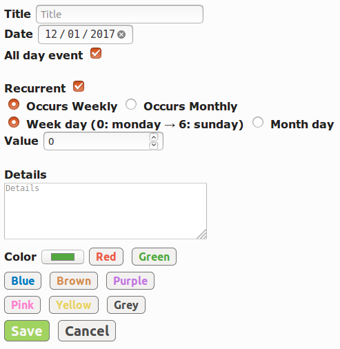

# flask-calendar

## Introduction

I recently (dec 2017) decided I wanted to opt out from Google services as much as possible. One of the services that tied me most was Calendar. There are not many alternatives, and even fewer web-based. I decided to try using a Trello board with due dates and some labels for a while, but proved to be harder to maintain. Add the lack of a month calendar view, and no support for recurrent/repetitive tasks, and I decided to do good use of a holidays to spend some hours and build a simple GCalendar clone.


### Details

Main calendar view:


Create new task view:


Built with Firefox, intended to work also on Chrome and Brave, should work also on other recent browsers, but I won't ever add support for Internet Explorer.

No Javascript libraries, no CSS frameworks. Of course the corresponding code and styles are accordingly non-impressive, but for such a small project didn't wanted to start adding Bootstraps/Foundations or JQuerys or similar.

No databases, as I don't need to do any querying or complex stuff I couldn't also do with JSON files and basic dictionaries.

Also intended to be a tiny Flask app so minimal coding and functionality used. I didn't wanted to use AJAX at first but quickly came up to the realization that some paths were actually faster so in the end has a few JS lines.

No tests built as main challenge has been my lack of CSS skills and rusty, outdated Javascript. Controllers are also a bit more fat than I'd like but I was just hacking away logic as required without much pre-planning.


Overall, lessons learned:

- Next project will be Django. What I win in speed building the routing and views, I lose then building validations.
- I suck at CSS so I'll stick to Bootstrap/Foundation. This time what I did works but I've spent more time fighting with CSS than building code.
- I'll give a try next time to turbolinks, to trully try to avoid javascript for tiny projects.


## Requirements

- Python 3.x (tested on 3.5)
- `flask`

## Running

```
python3 app.py
```

## TODOs / Roadmap

This are initially the only features I plan to build:

- edit existing event
- error messages
- requirements file
- mobile resolution support: if width <= 640 hide delete button, smaller fonts, etc.
- vanilla js drag & drop to change day of event (only inside same month)
- preselect current month and year upon entering new task creation
- a decent weekday and month day choosers when recurrency is selected
- Option to remove individual repetitions? (idea: repetition-exclude list with year-month-day as keys and ids as array values, then when saving calendar do a cleaning sweep of all past ones)
- Yearly repetition? (would need month and day)
- Users (should be able to access calendars), authentication and authorization
- Multi-day tasks?
- Type hints + mypy linting
